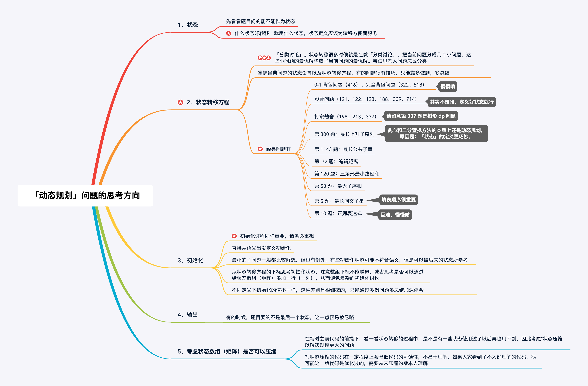

# Longest Palindromic Substring
Given a string s, find the longest palindromic substring in s. You may assume that the maximum length of s is 1000.

**Example 1:**

Input: "babad"
Output: "bab"
Note: "aba" is also a valid answer.

**Example 2:**

Input: "cbbd"
Output: "bb"



```java
public class Solution {

    public String longestPalindrome(String s) {
        int len = s.length();
        if (len < 2) {
            return s;
        }

        boolean[][] dp = new boolean[len][len];

        // 初始化
        for (int i = 0; i < len; i++) {
            dp[i][i] = true;
        }

        int maxLen = 1;
        int start = 0;

        for (int j = 1; j < len; j++) {
            for (int i = 0; i < j; i++) {

                if (s.charAt(i) == s.charAt(j)) {
                    if (j - i < 3) {
                        dp[i][j] = true;
                    } else {
                        dp[i][j] = dp[i + 1][j - 1];
                    }
                } else {
                    dp[i][j] = false;
                }

                // 只要 dp[i][j] == true 成立，就表示子串 s[i, j] 是回文，此时记录回文长度和起始位置
                if (dp[i][j]) {
                    int curLen = j - i + 1;
                    if (curLen > maxLen) {
                        maxLen = curLen;
                        start = i;
                    }
                }
            }
        }
        return s.substring(start, start + maxLen);
    }
}
```

> Reference  
> https://leetcode-cn.com/problems/longest-palindromic-substring